# Pytorch_study

## 1. 基本知识

### 1.1 基本流程

- 收集数据集DataSet
- 选择模型Model
- 训练Training
- 推理Inferring

### 1.2 数据集划分

| 训练集（x, y） | 测试集(x) |
| :------------: | :-------: |

| 训练集(x,y) | 开发集/验证集(x,y) | 测试集(x) |
| :---------: | :----------------: | :-------: |

### 1.3 损失函数/误差函数/残差 (Traning Loss)

$$
loss = (\hat{y} - y)^2
$$

$$
\text{MSE} = \text{cost} = \frac{1}{n} \sum_{i=1}^{n} (\hat{y}_i - y_i)^2
$$

Where, loss is one sample error; MSE is mean squared error, n is the amount of samples.

## 2. Linear Model

$$
\hat{y} = x \cdot \omega + b
$$

Where, the machine starts with a random guess.
$$
\omega = Random \  \ Value
$$

$$
\hat{y} = f(x)
$$

### 2-1. Q: Suppose that students would get Y points in final exam, if they spent X hovers in paper PyTorch Tutorial.

| X(hours) | Y(points) |
| :------: | :-------: |
|    1     |     2     |
|    2     |     4     |
|    3     |     6     |
|    4     |    ???    |

- The question is what would be the grade if I study 4 hours?

**A: Enumerating Method! We can find that the best parameters are located within an interval. So, we can enumerate all possibilities and plot the loss function curve, with the lowest point being the best parameters.**

From the image, it can be concluded that when the value of w is 2.0, the loss function is minimized, therefore this point is the best parameter.

### 2-2 Q: Try to use the model in (3), and draw the cost graph.

**Tips:**

- You can read the material of how to draw 3d graph.
- Function **np.meshgrid()** is very popular for drawing 3d graph, read the docs and utilize vectorization calculation

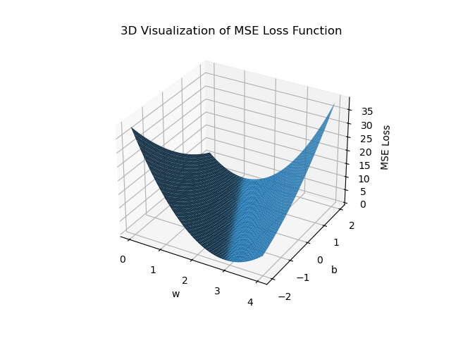

## 3. Gradient Descent

$$
\text{Gradient}=\frac{\partial \cos t}{\partial w}
$$

Where,  cost is y-axis and w is x-axis.

So, how to **update** ?
$$
w = w - \alpha \times \frac{\partial \cos t}{\partial w}
$$
Where, alpha is the learning rate and it should be set to a smaller value.
$$
\frac{\partial \text{cost}(\omega)}{\partial \omega} = \frac{\partial}{\partial \omega} \frac{1}{N} \sum_{n=1}^{N} (x_n \cdot \omega - y_n)^2

= \frac{1}{N} \sum_{n=1}^{N} \frac{\partial}{\partial \omega} (x_n \cdot \omega - y_n)^2

= \frac{1}{N} \sum_{n=1}^{N} 2 \cdot (x_n \cdot \omega - y_n) \frac{\partial (x_n \cdot \omega - y_n)}{\partial \omega}

= \frac{1}{N} \sum_{n=1}^{N} 2 \cdot x_n \cdot (x_n \cdot \omega - y_n)
$$

### 3-1. Q: Try to use the gradient descent to find the MSE.

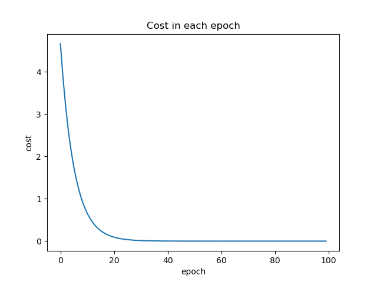

### 3-2. Q: Try to use the stochastic gradient descent to find the MSE.

What is **Stochastic Gradient Descent**?
$$
\text{Stochastic Gradient}=\frac{\partial loss}{\partial w}
$$
Where, loss is the loss value of a random sample.

So, how to update?
$$
w = w - \alpha \times \frac{\partial loss}{\partial w}
$$

$$
\frac{\partial  loss_n}{\partial \omega} = 2 \cdot x_n \cdot (x_n \cdot \omega - y_n)
$$

By using stochastic gradient descent, we can avoid getting stuck at saddle points.

### 3-3. What is Batch and Mini-Batch?

Group the dataset and calculate the gradient of each group for updating at each time step.

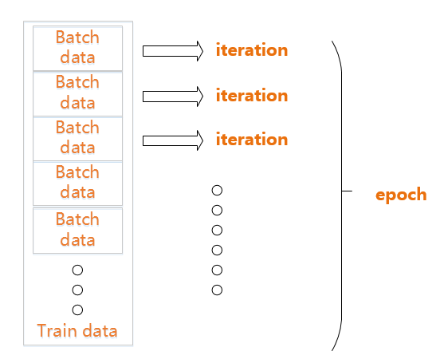

## 4. Back Propagation

A two layer neural network is
$$
\hat{y} = W_2(W_1 \cdot X + b_1) + b_2
$$
Where, W is the weight matrix and b is the bias.

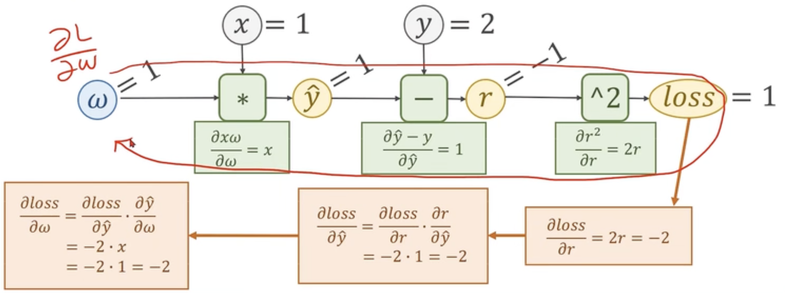

### 4-1. Q: Compute the gradient with Computational Graph.

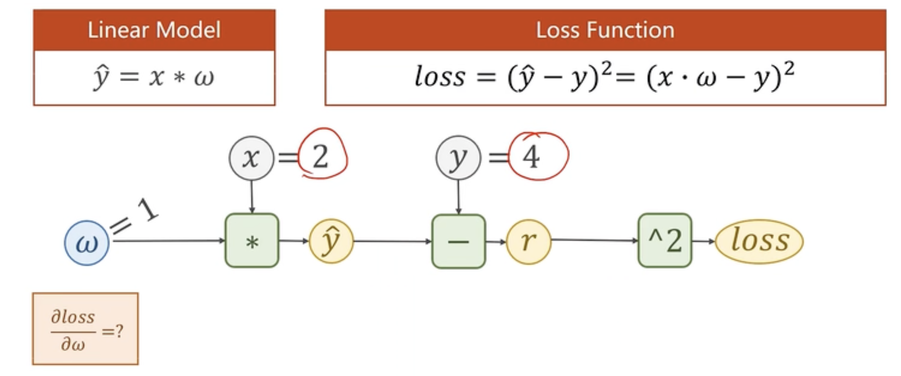

A:

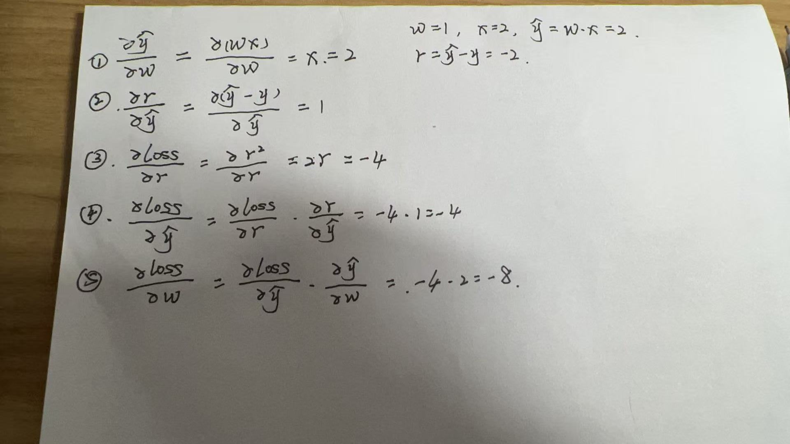

### 4-2. Q: Compute gradient of Affine model.

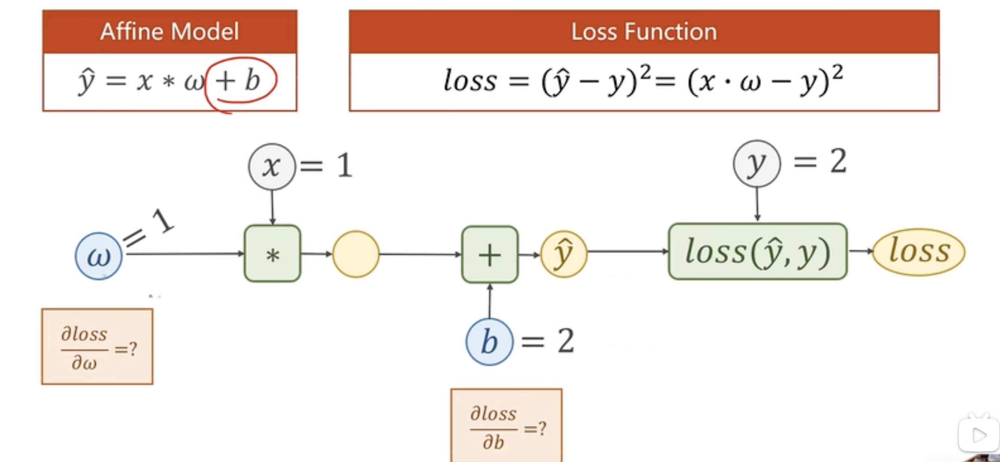

A:

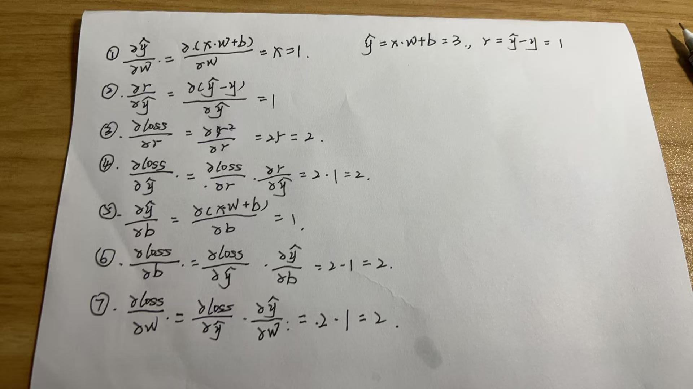

### 4-3. What is Tensor?

In PyTorch, Tensor is the important component in constructing dynamic computational graph.

It contains data and grad, which storage the value of node and gradient w.r.t loss respectively.

- **用 `.data`**：
  - 需要修改张量的值（如更新模型权重 `weight.data -= lr * weight.grad`）。
  - 需要访问张量的数据但不想影响梯度计算。
- **用 `.item()`**：
  - 需要将单元素张量转换为 Python 数值（如打印 loss、计算指标）。

### 4-4. Q: Compute gradients using PyTorch.

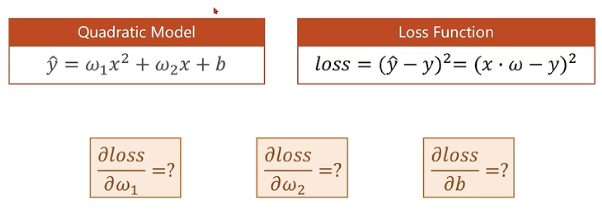

## 5. Linear Regression with PyTorch

## 6. Logistic Regression

Although it is called "regression", it is used for classification tasks

In classification, the output of model is the **probability** of input belongs to the exact class.

How to map? R --> [0, 1]? **Use Logistic Function!**
$$
\sigma(x) = \frac{1}{1 + e^{-x}}
$$

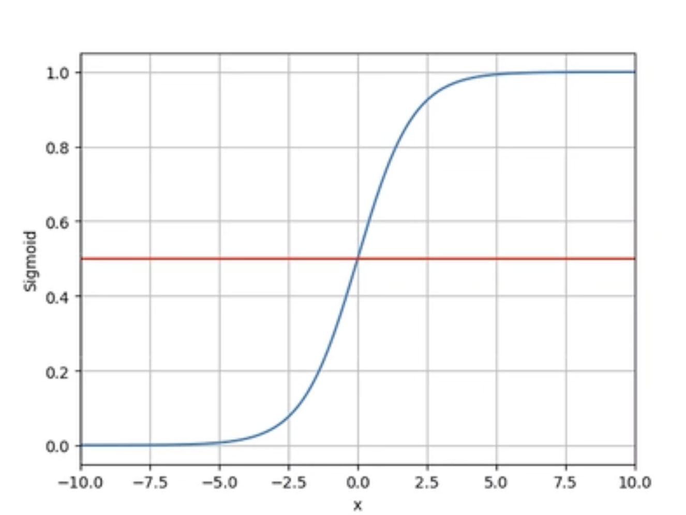

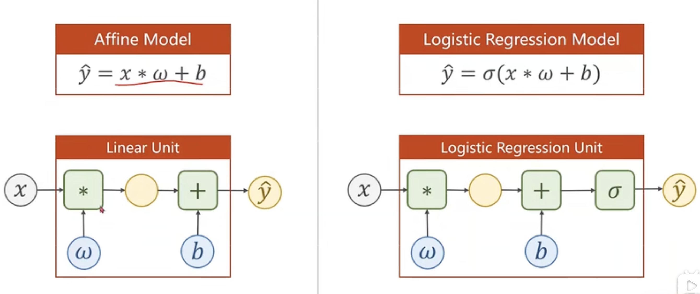

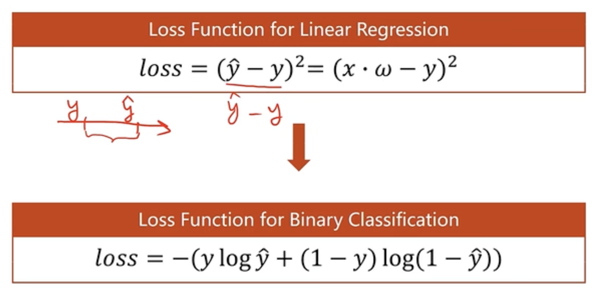

The Loss Function is called BCE_Loss.

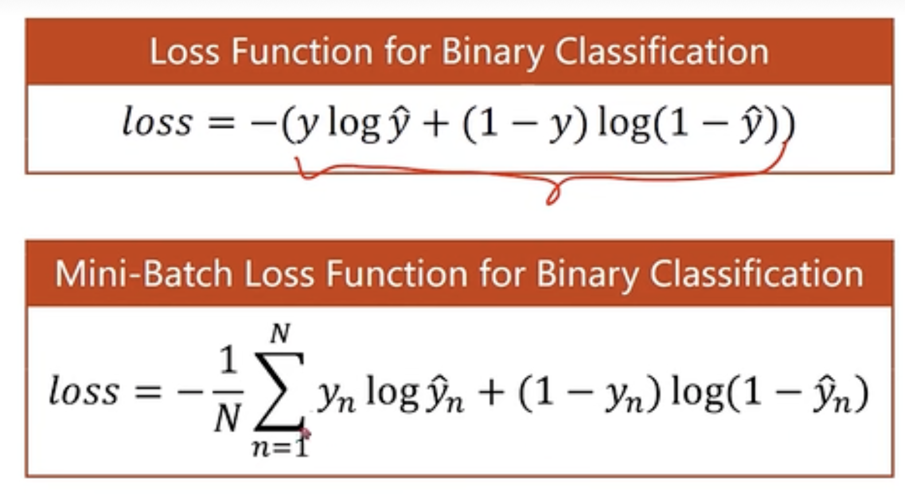

Test the model...

| x(hours) | y(pass/fail) |
| -------- | ------------ |
| 1        | 0(fail)      |
| 2        | 0(fail)      |
| 3        | 1(pass)      |
| 4        | ?            |
| ...      | ?...         |

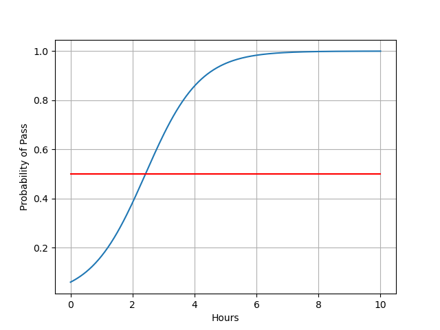

## 7. Multiple Dimension Input

DataSet:

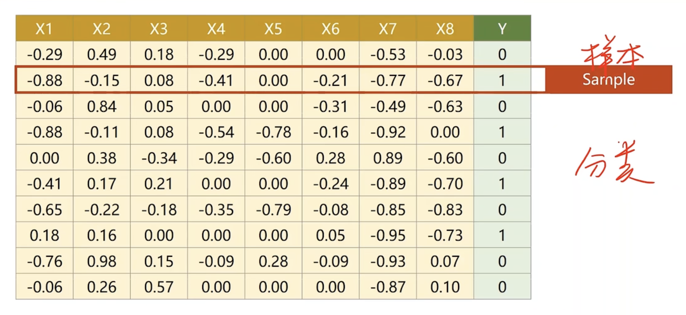

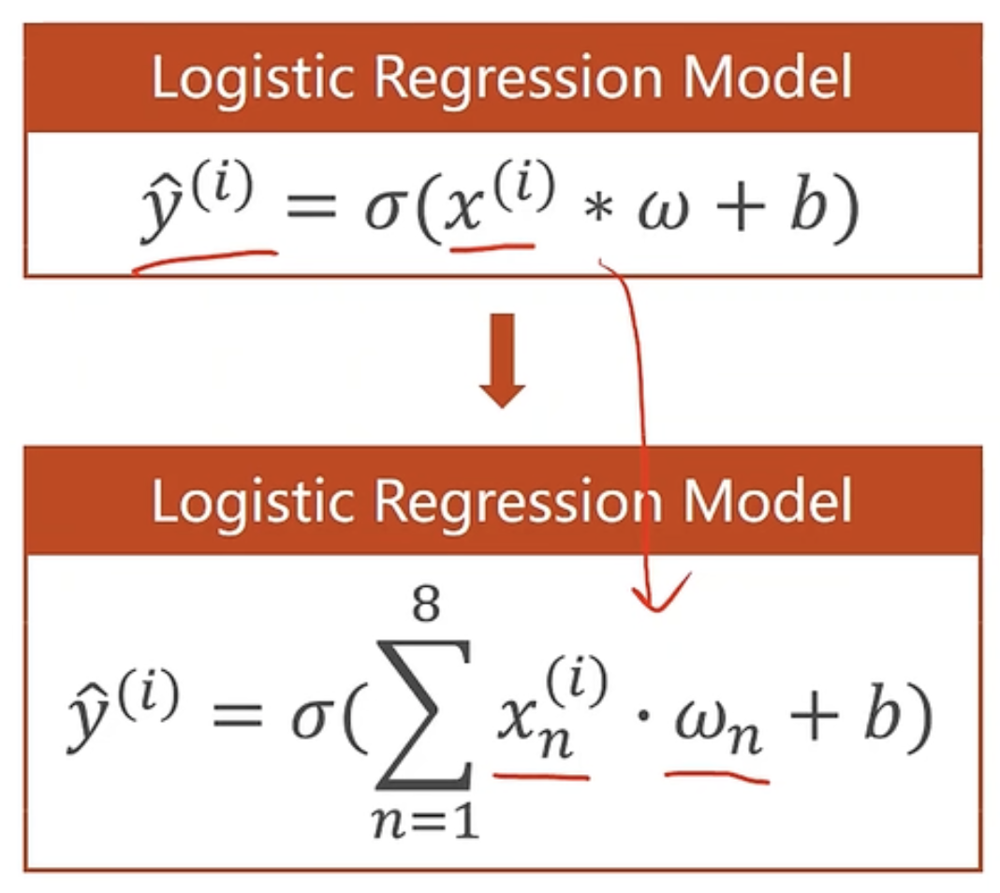

notice! The first param of Linear is the dimension of input and the second param of Linear is the dimension of the output.

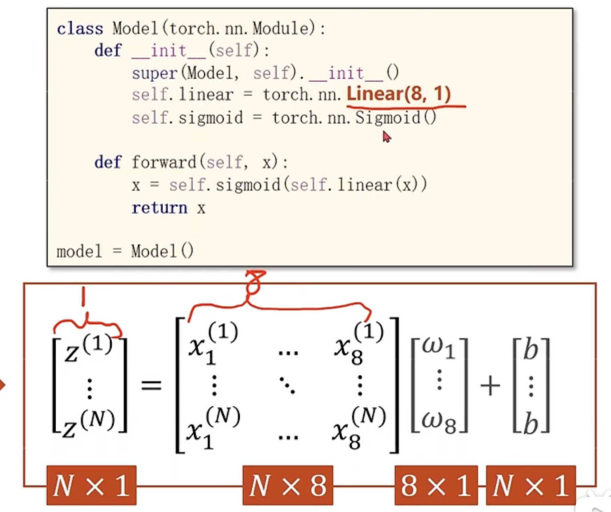

The new model.

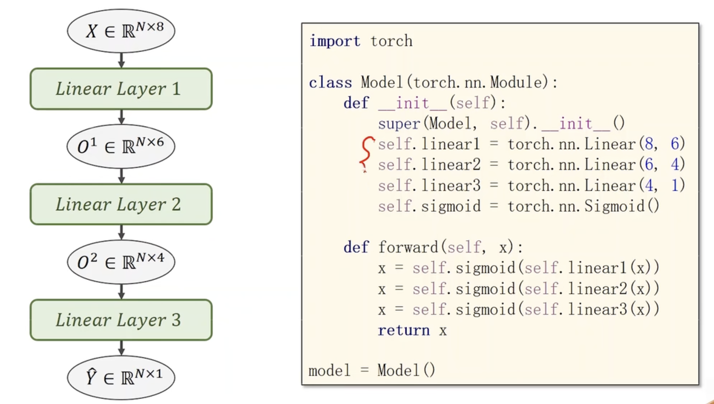

Change the activate function.

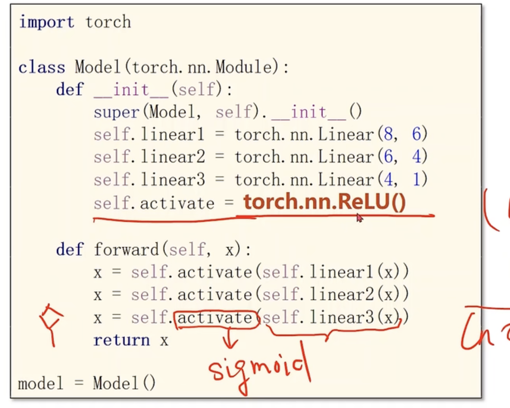

## 8. Dataset and DataLoader

### 8-1. Build a classifier using the DataLoader and Dataset 《titanic》.

