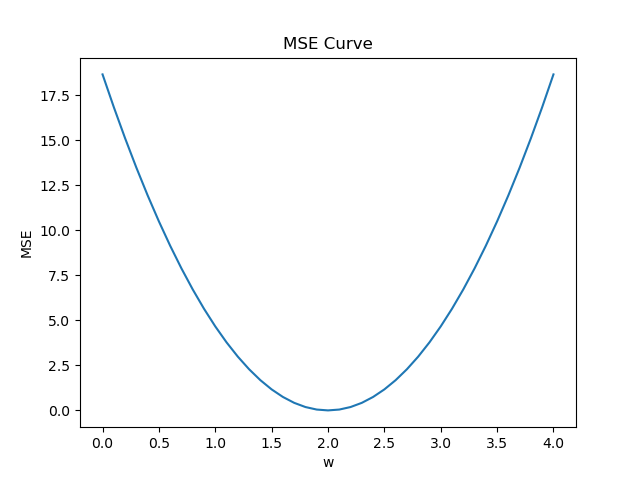

# Pytorch_study

## 1. 基本知识

### 1.1 基本流程

- 收集数据集DataSet
- 选择模型Model
- 训练Training
- 推理Inferring

### 1.2 数据集划分

| 训练集（x, y） | 测试集(x) |
| :------------: | :-------: |

| 训练集(x,y) | 开发集/验证集(x,y) | 测试集(x) |
| :---------: | :----------------: | :-------: |

### 1.3 损失函数/误差函数/残差 (Traning Loss)

$$
loss = (\hat{y} - y)^2
$$

$$
\text{MSE} = \text{cost} = \frac{1}{n} \sum_{i=1}^{n} (\hat{y}_i - y_i)^2
$$

where, loss is one sample error; MSE is mean squared error, n is the amount of samples.

## 2. Linear Model

$$
\hat{y} = x \cdot \omega + b
$$

where, the machine starts with a random guess.
$$
\omega = Random \  \ Value
$$

$$
\hat{y} = f(x)
$$

### 2-1. Q: Suppose that students would get Y points in final exam, if they spent X hovers in paper PyTorch Tutorial.

| X(hours) | Y(points) |
| :------: | :-------: |
|    1     |     2     |
|    2     |     4     |
|    3     |     6     |
|    4     |    ???    |

- The question is what would be the grade if I study 4 hours?

**A: Enumerating Method! We can find that the best parameters are located within an interval. So, we can enumerate all possibilities and plot the loss function curve, with the lowest point being the best parameters.**

From the image, it can be concluded that when the value of w is 2.0, the loss function is minimized, therefore this point is the best parameter.

